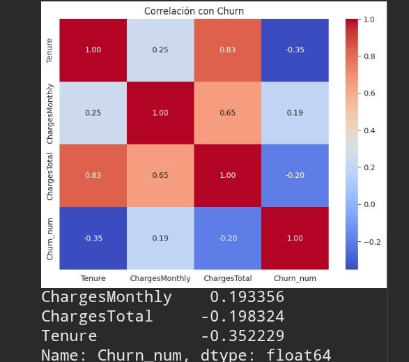
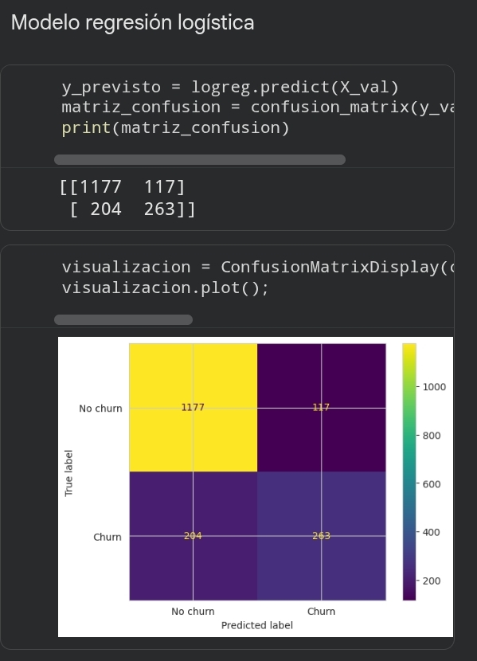

# Telecom-2
Desarrollo de modelos predictivos para la empresa Telecom X, aplicando Machine Learning.

## 💡 Descripción del proyecto 💡

🎯 Misión
Desarrollar modelos predictivos capaces de prever qué clientes tienen mayor probabilidad de cancelar sus servicios.

🧠 Objetivos del Desafío

•
Preparar los datos para el modelado (tratamiento, codificación, normalización).

•
Realizar análisis de correlación y selección de variables.

•
Entrenar dos o más modelos de clasificación.

•
Evaluar el rendimiento de los modelos con métricas.

•
Interpretar los resultados, incluyendo la importancia de las variables.

•
Crear una conclusión estratégica señalando los principales factores que influyen en la cancelación.

## 🛠️ Preparación de los Datos 

## 🎯 Correlación y Selección de Variables 

## 🤖 Modelado Predictivo

## 📖 Informe

Análisis de la importancia de las variables

1• Tenure(Antigüedad): Clientes con poca antigüedad tiene mucho más riesgo de cancelar.

2•ChargesMonthly( Cargo mensual): A mayor cargo mensual mayor riesgo de cancelar.

3•Tipo de contrato

4• Servicios adicionales: Reduce el riesgo.

5• InternetService: Los clientes con fibra óptica muestran mayor prospección a cancelar que los que tienen DSL.

6• Métodos de pagos: Pagos automáticos con transferencia bancaria muestran menos churn.

Resumen ejecutivo:

El presente informe detalla los resultados del análisis de cancelación de los clientes de la empresa de Telecom X. Se evaluaron múltiples modelos predictivos y se identificaron los valores de riesgos más significativos. Los modelos de Regresión Logística y redes neuronales con umbral ajustado mostraron el mejor desempeño, logrando detectar la mayor cantidad de cancelaciones con un equilibrio aceptable de falsas alarmas. Las principales causas de Churn son:

1• Alto costo mensual.

2• Contratos de corto plazo.

3• Baja antigüedad del cliente (Clientes nuevos)

• Variables analizadas:

Se incluyeron variables numéricas y categóricas luego de aplicar One hot
encoding.

• Modelos evaluados:

Dummy

Árbol de decisión

KNN

Random Forest

Redes Neuronales

Regresión logística

• Métrica principal:

Dado el desbalance de las clases, aproximadamente 27% de cancelaciones. Se priorizó el Recall(Sensibilidad) para la clase Churn complementado con precisión y F1-score.

• Estrategias de retención:

Ofertas de migración: Ofrecer incentivos para migrar a contratos anuales.

Revisión del valor: Contactar al cliente y preguntar si se siente satisfecho con el precio y el servicio.

Personalización de los planes: Ajustar los planes y ofrecer planes más económicos.
